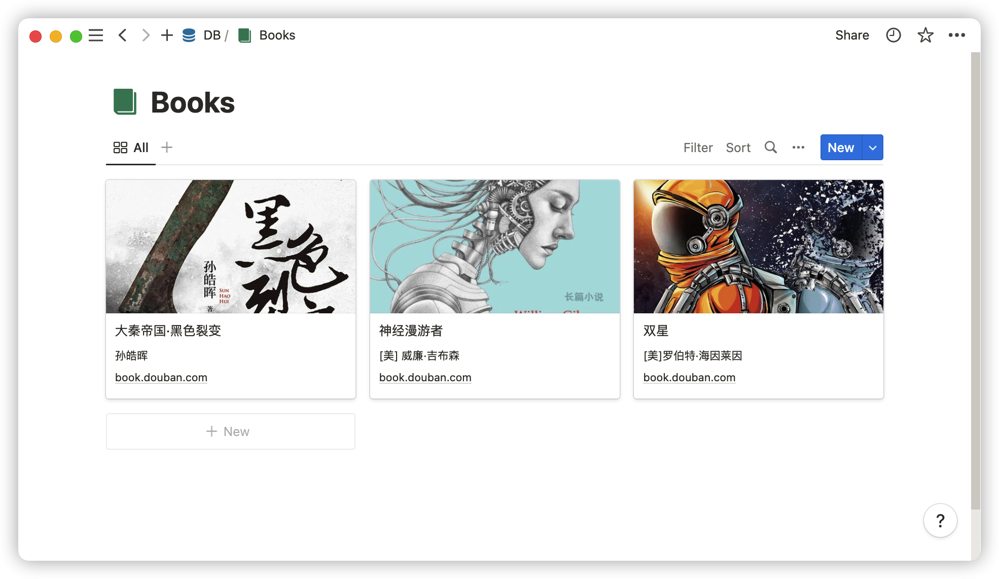
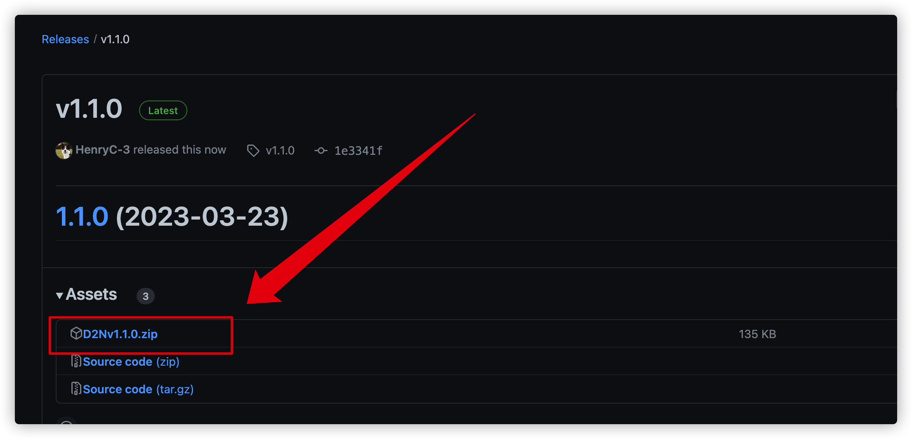

---

D2N（Douban to Notion）是一个 chrome 插件，用于将豆瓣图书页的相关信息快速添加到 Notion Database 中。包含以下功能

- 🕸️ 抓取豆瓣书籍信息，告别复制粘贴
- 📓 为书籍添加笔记，捕捉添加瞬间想法
- 🔘 <kbd style="background:#4EAADC; color: white; border-radius: 2px; height:100%">view in notion</kbd> 按钮，查看已添加到 Notion 中的书籍
- 🔗 跳转到 Notion，无缝切换到 Notion
- ⚡️ 快捷键支持

---

视频演示

https://user-images.githubusercontent.com/41246463/224534553-ffad7296-e7fc-479c-affa-5175bd3de114.mov

截图

- 添加书籍
  
- 在 Notion 中保存的信息
  
- Gallery View 效果
  

安装

- 前往 [下载页面](https://github.com/HenryC-3/D2N/releases)，下载最新的插件压缩包并解压 
- 打开浏览器插件管理页，打开 `开发者模式`，选择 `添加已解压的插件`。随后在文件管理器中选择已解压的 `d2n-v0.1.0` 文件夹
  

使用

首次使用需要提供 `Token Secret` 和 `Database ID`，具体操作步骤见 [使用 D2N 添加豆瓣书籍到 Notion](https://henryhe74.notion.site/D2N-Notion-8e6363356ad2419585fe775cf79c46a9)

## License

[MIT](./LICENSE)
