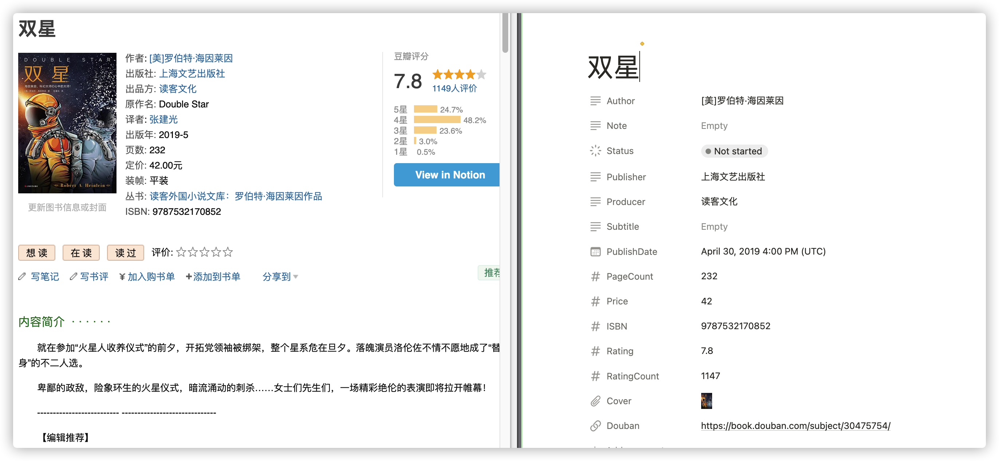

<div style="display: flex; justify-content:center; width: 100%; height: 180px;background-image: url('./docs/2023-03-12-15-30-21.png'); background-size: cover"></div>

https://user-images.githubusercontent.com/41246463/224534553-ffad7296-e7fc-479c-affa-5175bd3de114.mov

## 简介

D2N（Douban to Notion）是一个 chrome 插件，用于将豆瓣图书页的相关信息快速添加到 Notion Database 中。 



<!--  -->

## 功能

- 🕸️ 抓取豆瓣书籍信息，告别复制粘贴
- 📓 为书籍添加笔记，捕捉添加瞬间想法
- 🔘 <kbd style="background:#4EAADC; color: white; border-radius: 2px; height:100%">view in notion</kbd> 按钮，查看已添加到 Notion 中的书籍
- 🔗 跳转到 Notion，无缝切换到 Notion
- ⚡️ 支持快捷键

## 开发

1. 安装依赖

```bash
pnpm i
npm run dev
```

2. 安装插件，详见 [load-unpacked-extension](https://developer.chrome.com/docs/extensions/mv3/getstarted/development-basics/#load-unpacked)

## 证书

[MIT](./LICENSE)
